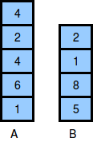
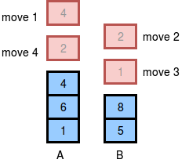

# Game of Two Stacks
Alexa has two stacks of non-negative integers, stack **A = [a0,a1,...,an-1]** and stack **B = [b0,b1,...,bm-1]** where index denotes the top of the stack. Alexa challenges Nick to play the following game:
- In each move, Nick can remove one integer from the top of either stack **A** or stack **B**.
- Nick keeps a running sum of the integers he removes from the two stacks.
- Nick is disqualified from the game if, at any point, his running sum becomes greater than some integer  given at the beginning of the game.
- Nick's final score is the total number of integers he has removed from the two stacks.

Given **A**, **B**, and **x**, find the maximum possible score Nick can achieve (i.e., the maximum number of integers he can remove without being disqualified) during the game and print it on a new line.

## Output Format
Print an integer on a new line denoting the maximum possible score Nick can achieve without being disqualified.

## Sample Input
    10

    4 2 4 6 1

    2 1 8 5

## Sample Output
    4

## Explanation
The two stacks initially look like this:

The image below depicts the integers Nick should choose to remove from the stacks. We print **4** as our answer, because that is the maximum number of integers that can be removed from the two stacks without the sum exceeding **x = 10**.

(There can be multiple ways to remove the integers from the stack, the image shows just one of them.)

[HackerRank link](https://www.hackerrank.com/challenges/game-of-two-stacks/problem?utm_campaign=challenge-recommendation&utm_medium=email&utm_source=24-hour-campaign)